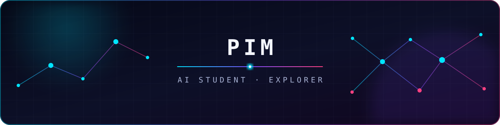

<div align="center">
  
</div>

<div align="center">
  <a href="https://git.io/typing-svg">
    
  </a>
</div>

<p align="center">
  <code>learn</code> · <code>experiment</code> · <code>build</code> · <code>repeat</code>
</p>

---

### `> whoami`

```python
class Pim:
    role = "AI Student"
    mode = "always learning"
    interests = ["Machine Learning", "Deep Learning", "LLM Applications"]
    mission = "Turn curiosity into things that work."
```

I'm an AI student exploring how intelligent systems learn, reason, and create. This profile is my learning log — projects will appear here as experiments become real.

### `> current_focus`

<p>
  
  
  
  
</p>

- 🧠 Building strong foundations in AI and machine learning
- 🧪 Turning new ideas into small, testable experiments
- 🚀 Growing this space one meaningful project at a time

### `> system_metrics`

<div align="center">
  
  
</div>

<div align="center">
  
</div>

---

<div align="center">
  
  <br /><br />
  <sub>Stay curious. Keep building. ⚡</sub>
</div>
